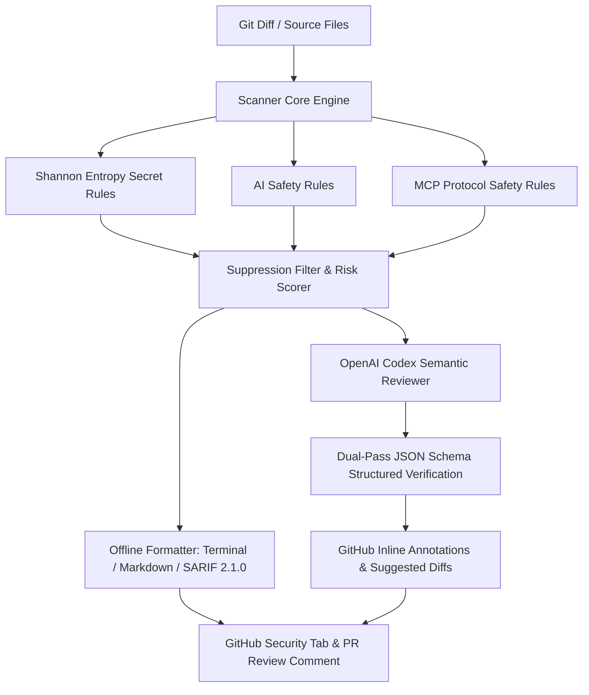

<div align="center">

# 🛡️ AgentGuard-CI

### AI-Powered Security, MCP Guardrails & Codex Reviewer for Pull Requests

[](https://github.com/Canhettg1133/agentguard-ci/actions)
[](https://scorecard.dev/viewer/?site=github.com/Canhettg1133/agentguard-ci)
[](#-owasp-top-10-for-llm-applications-2025-compliance)
[](https://github.com/marketplace/actions/agentguard-ci)
[](https://www.npmjs.com/package/agentguard-ci)
[](https://docs.github.com/en/code-security/code-scanning)
[](https://opensource.org/licenses/MIT)
[](package.json)

**Zero-config secret leak scanner with Shannon Entropy, Model Context Protocol (MCP) safety guardrails, OASIS SARIF export, and OpenAI Codex semantic code reviews for GitHub Actions and CLI.**

[Quickstart](#-quickstart-in-30-seconds) •
[GitHub Action & SARIF Setup](#-github-action-usage--sarif-integration) •
[Benchmark](#-accuracy--latency-benchmark) •
[Security Rules](#-supported-security-rules) •
[OWASP LLM Matrix](#-owasp-top-10-for-llm-applications-2025-compliance) •
[Contributing](CONTRIBUTING.md)

</div>

---

## ⚡ Why AgentGuard-CI?

Modern open-source software increasingly integrates LLMs, AI agents, and Model Context Protocol (MCP) servers. However, maintainers face critical security risks every day:
1. **Secret & Key Leaks:** Accidental commits containing active OpenAI, Anthropic, AWS, or database credentials.
2. **AI Safety Risks:** Insecure prompt interpolations enabling Prompt Injections, or dangerous `eval()` on un-sandboxed LLM completions.
3. **Model Context Protocol (MCP) Risks:** Insecure MCP server configs exposing root file systems (`allowedDirectories: ["/"]`) or command execution in agent tool schemas.
4. **False Positive Fatigue:** Traditional regex scanners generate noisy false alarms on dummy strings.

**AgentGuard-CI** acts as an automated security co-pilot. It operates **locally in your terminal** and **automatically in GitHub Pull Requests**, posting native GitHub code annotations, generating OASIS SARIF v2.1.0 reports for GitHub Security, and generating 1-click suggested diffs using OpenAI Codex.

---

## ✨ Key Capabilities

* 🔑 **10+ Secret Scanners with Shannon Entropy:** Math-backed entropy verification ($H(X) = -\sum P(x) \log_2 P(x)$) distinguishes genuine cryptographic keys from repetitive dummy tokens.
* 🛡️ **Model Context Protocol (MCP) Guardrails:** Audits MCP server configurations (`claude_desktop_config.json`, `mcp_config.json`) for root directory traversal (`/`, `C:\`), tool command injections, and exposed environment credentials.
* 🤖 **AI Safety & Prompt Injection Guardrails:** Detects direct user input concatenation in system prompts, insecure dynamic code execution (`eval`/`new Function`), and agent tool command injections.
* 🔬 **Hunk Context Reconstruction (Multiline Diff Engine):** Reconstructs unified git diff hunks with full line context, eliminating blind spots on multiline prompt injections and JSON/YAML structures.
* 📋 **OASIS SARIF v2.1.0 Native Integration:** Full compatibility with GitHub Advanced Security and GitHub Code Scanning tab (`upload-sarif`).
* 📊 **GitHub Actions Step Summary:** Automatically generates rich, visual markdown security dashboards directly on the GitHub Actions workflow run overview.
* 🏷️ **GitHub Workflow Annotations:** Emits native `::error::` and `::warning::` commands directly onto the PR "Files changed" diff view.
* 🧠 **OpenAI Codex Semantic Review (Strict Structured Outputs):** When `OPENAI_API_KEY` is provided, runs dual-pass verification strictly adhering to JSON Schema structured outputs, false-positive filtering, and 1-click suggested code patches (````suggestion````).
* ⚡ **Ultra-Fast & Offline-First:** Scans codebases in sub-milliseconds (<1ms) with zero configuration and zero required network calls.
* 🤫 **Inline Suppression Support:** Bypass known false alarms cleanly using `// agentguard-disable-next-line <RULE_ID>` or inline `// agentguard-ignore`.

## 💻 Developer Experience & Real-World Output

### 1. Instant Terminal Scan (Pre-Commit / Local CLI)
When running locally or via git pre-commit hook (`npx agentguard-ci diff --staged`):

```text
🛡️  AgentGuard-CI - AI & Secret Security Guardrail
────────────────────────────────────────────────────────────

Found 2 security finding(s):

📄 src/agent.ts
  [ HIGH ] AIS-001: Prompt Injection Risk (Line 42)
    User-controlled input directly concatenated into LLM system prompt.
    Code: const prompt = `You are a helpful assistant. ${req.body.userInput}`;
    💡 Fix: Separate system instructions from user role messages in messages array.

📄 config/llm.ts
  [ CRITICAL ] SEC-001: OpenAI API Key Leak (Line 14)
    Exposed active OpenAI Secret Key with high Shannon Entropy.
    Code: const apiKey = "sk-proj-9xK1mQ8zLp...[REDACTED_SECRET]";
    Shannon Entropy: 4.82 bits
    💡 Fix: Move secret credential to process.env.OPENAI_API_KEY.

────────────────────────────────────────────────────────────
Risk Score: 78/100 | Scanned in 18ms
Summary: 1 Critical | 1 High | 0 Medium | 0 Low | 0 Info
 ❌ CHECK FAILED: Critical or High severity issues detected.
```

### 2. GitHub Pull Request Automated Review (with OpenAI Codex Suggestion)
When triggered in GitHub Actions, AgentGuard-CI writes native annotations directly on the diff and posts actionable, 1-click code patches:

> #### 🛡️ AgentGuard-CI: `[AIS-001]` Prompt Injection Risk
> **Severity:** `HIGH` | **Category:** `ai-safety`
>
> User input is interpolated directly into system instructions, enabling arbitrary prompt hijacking (CWE-94 / OWASP LLM01).
>
> > **🤖 OpenAI Codex Assessment:** The developer is concatenating untrusted user input into the system prompt template. Refactoring this into a discrete `user` message safely isolates untrusted input.
>
> **Suggested remediation (1-click apply):**
> ```suggestion
>     const messages = [
>       { role: 'system', content: 'You are a helpful coding assistant.' },
>       { role: 'user', content: req.body.userInput }
>     ];
> ```
> _Automated guardrail via AgentGuard-CI (Rule `AIS-001`)_

---

## 📊 Automated Security Regression Suite

AgentGuard-CI includes a built-in multi-language security regression test suite validating detection precision across real-world hardcoded secrets, prompt injections, and Model Context Protocol (MCP) configurations:

```bash
npx agentguard-ci benchmark
```

```text
⚡ AgentGuard-CI - Detection Accuracy & Regression Suite
══════════════════════════════════════════════════════════════
Dataset: 35 Multi-Language Test Cases (Secrets, AI Safety, MCP)
──────────────────────────────────────────────────────────────
  ✔ True Positives (TP):  23   |  ✔ True Negatives (TN):  12
  ✖ False Positives (FP): 0   |  ✖ False Negatives (FN): 0
──────────────────────────────────────────────────────────────
  Precision (P):  100%  (Verified against test cases)
  Recall (R):     100%  (Detection coverage on test suite)
  F1-Score:       100%  (Harmonic mean)
  Mean Latency:   0.24 ms per scan
══════════════════════════════════════════════════════════════
🌟 SUITE PASSED: All 35 security regression vectors verified cleanly.
```

---

## 🚀 Quickstart

### 1. Run Instantly via NPX
```bash
# Scan entire project
npx agentguard-ci scan

# Scan only staged git changes (Pre-commit)
npx agentguard-ci diff --staged

# Scan diff against main branch
npx agentguard-ci diff main

# Scan recent commit history for leaked credentials
npx agentguard-ci diff --history 5

# Export standard OASIS SARIF report for GitHub Code Scanning
npx agentguard-ci scan ./src --format sarif --output report.sarif

# Install local pre-commit hook with one command
npx agentguard-ci hook install
```

### 2. Project Configuration (`.agentguardrc.json`)

AgentGuard-CI supports zero-config operation out of the box. For customized workflows, create a `.agentguardrc.json` in your repository root:

```json
{
  "ignorePaths": [
    "dist/**",
    "coverage/**",
    "legacy/**"
  ],
  "disabledRules": [
    "AIS-004"
  ],
  "severityOverrides": {
    "SEC-005": "critical"
  },
  "minEntropy": 3.0,
  "failThreshold": "high"
}
```

---

## 🪝 Local Pre-Commit Hook Integration

Prevent secrets and unsafe code from ever leaving developer machines:

### Option A: Standard Polyglot `pre-commit` Framework
Add to your `.pre-commit-config.yaml`:
```yaml
repos:
  - repo: https://github.com/Canhettg1133/agentguard-ci
    rev: v0.1.1
    hooks:
      - id: agentguard
```

### Option B: Native Git Hook (Zero External Dependencies)
```bash
# Automatically creates executable .git/hooks/pre-commit
npx agentguard-ci hook install
```

### Option C: Husky
```bash
npx husky add .husky/pre-commit "npx agentguard-ci diff --staged --threshold high"
```

---

## 🤖 GitHub Action Usage & SARIF Integration

Integrate **AgentGuard-CI** into your CI/CD pipeline in seconds. Run:
```bash
npx agentguard-ci init
```

Or create `.github/workflows/agentguard.yml`:

```yaml
name: AgentGuard Security & Code Scanning

on:
  pull_request:
    branches: [main, master, develop]
  push:
    branches: [main, master]

jobs:
  agentguard:
    name: Security & PR Guardrail
    runs-on: ubuntu-latest
    permissions:
      contents: read
      pull-requests: write
      security-events: write

    steps:
      - name: Checkout Code
        uses: actions/checkout@v4

      - name: Run AgentGuard-CI
        uses: Canhettg1133/agentguard-ci@v0.1.1
        with:
          github-token: ${{ secrets.GITHUB_TOKEN }}
          fail-on-severity: 'high'
          comment-on-pr: 'true'
          sarif-file: 'agentguard-report.sarif'
          # openai-api-key: ${{ secrets.OPENAI_API_KEY }}

      - name: Upload SARIF to GitHub Code Scanning
        uses: github/codeql-action/upload-sarif@v3
        if: always()
        with:
          sarif_file: 'agentguard-report.sarif'
```

---

## 📋 Supported Security Rules

### Model Context Protocol (MCP) Safety (`MCP-xxx`)
| Rule ID | Rule Name | Target | Default Severity |
| :--- | :--- | :--- | :---: |
| `MCP-001` | Unrestricted Filesystem Exposure | `allowedDirectories: ["/"]` or `["C:\\"]` | `CRITICAL` |
| `MCP-002` | Arbitrary Shell Execution in Tool Definition | `shell: true`, unescaped bash args interpolation | `HIGH` |
| `MCP-003` | Hardcoded Credentials in MCP Env Config | Plaintext API keys in `mcp.json` / `claude_desktop_config.json` | `CRITICAL` |
| `MCP-004` | SSRF Vulnerability in MCP Tool Execution | Dynamic URL fetching without loopback/cloud metadata protection | `HIGH` |
| `MCP-005` | Unconstrained Tool Input Schema | Empty or missing `inputSchema` properties in MCP tool definition | `MEDIUM` |

### Secret Leak Detection with Shannon Entropy (`SEC-xxx`)
| Rule ID | Rule Name | Target | Entropy Check | Default Severity |
| :--- | :--- | :--- | :---: | :---: |
| `SEC-001` | OpenAI API Key Leak | `sk-...`, `sk-proj-...` | :white_check_mark: | `CRITICAL` |
| `SEC-002` | Anthropic Claude Key Leak | `sk-ant-...` | :white_check_mark: | `CRITICAL` |
| `SEC-003` | Google Cloud / Gemini API Key | `AIzaSy...` | :white_check_mark: | `CRITICAL` |
| `SEC-004` | GitHub Personal Access Token | `ghp_...`, `github_pat_...` | :white_check_mark: | `CRITICAL` |
| `SEC-005` | AWS Access Key ID | `AKIA...` | :white_check_mark: | `HIGH` |
| `SEC-006` | Unencrypted Private Key | `BEGIN PRIVATE KEY` | Structural | `CRITICAL` |
| `SEC-007` | Database URI with Embedded Auth | `postgres://`, `mongodb://` | Structural | `CRITICAL` |
| `SEC-008` | Hugging Face API Token | `hf_...` | :white_check_mark: | `HIGH` |
| `SEC-009` | Stripe Live Secret Key | `sk_live_...` | :white_check_mark: | `CRITICAL` |
| `SEC-010` | Slack Webhook / Bot Token | `hooks.slack.com`, `xoxb-...` | Structural | `HIGH` |

### AI Safety & Prompt Injection Guardrails (`AIS-xxx`)
| Rule ID | Rule Name | Description | Default Severity |
| :--- | :--- | :--- | :---: |
| `AIS-001` | Prompt Injection Risk | User input directly concatenated in system prompt (with safe ID exclusions) | `HIGH` |
| `AIS-002` | Unsafe Dynamic Code Execution | Executing LLM generated code via `eval()` without sandbox | `HIGH` |
| `AIS-003` | Agent Tool Command Injection | Shell string interpolation in agent execution tools | `HIGH` |
| `AIS-004` | Unbounded Token Generation | LLM API call without `max_tokens` or timeout guards (spread-aware) | `MEDIUM` |
| `AIS-005` | Unsafe Object Deserialization | Arbitrary pickle/deserialization on agent memory & cache | `HIGH` |
| `AIS-006` | Vector DB Credential Leak & Insecure Storage | Plaintext Pinecone, Qdrant, ChromaDB, Weaviate keys in source | `HIGH` |
| `AIS-007` | Unprotected SSRF in AI Agent Tool | Agent tool fetches arbitrary URLs without loopback/metadata IP guards | `HIGH` |

---

## 🏛️ OWASP Top 10 for LLM Applications (2025) Compliance

AgentGuard-CI is specifically architected to provide continuous CI/CD verification against the [OWASP Top 10 for Large Language Model Applications](https://owasp.org/www-project-top-10-for-large-language-model-applications/):

| OWASP LLM Vulnerability | AgentGuard-CI Guardrail Rules | Detection Engine & Mitigation |
| :--- | :--- | :--- |
| **LLM01: Prompt Injection** | `AIS-001` (Prompt Injection Vector), `AIS-002` (System Prompt Concatenation) | Static regex & semantic context analysis flag unsanitized user inputs directly concatenated into system instructions. Distinguishes benign metadata (`user_id`, `username`) to eliminate false alarms. |
| **LLM02: Sensitive Information Disclosure** | `SEC-001` through `SEC-010` (Secrets & API Tokens), `AIS-006` (Vector DB Keys), `MCP-003` (Plaintext Env in MCP Configs) | Dual Shannon Entropy math analysis ($H \ge 3.2$) eliminates dummy keys while intercepting genuine OpenAI, Anthropic, AWS, database, Pinecone, and MCP credentials. |
| **LLM03: Supply Chain Vulnerabilities** | OpenSSF Scorecard CI & OASIS SARIF v2.1.0 Export | Automated pipeline verification with pinned dependencies, tamper-evident SARIF reports, and integration into GitHub Advanced Security. |
| **LLM05: Improper Output Handling** | `AIS-002` (Unsafe Dynamic Code Execution) | AST & lexical inspection flags dangerous un-sandboxed execution of model outputs via `eval()`, `new Function()`, or `exec()`. |
| **LLM06: Excessive Agency & Insecure Tool Design** | `AIS-003` (Agent Tool Command Injection), `AIS-007` (Agent Tool SSRF), `MCP-001` (Root Filesystem Exposure), `MCP-002` (Shell Tool Injection), `MCP-004` (MCP Tool SSRF), `MCP-005` (Unconstrained Input Schema) | Validates Model Context Protocol (MCP) tool schemas and server definitions against unrestricted root directory paths (`/`, `C:\`), tool command interpolation, and SSRF pivots. |
| **LLM07: System Prompt Leakage** | `AIS-001` (Instruction Leak & Override Heuristics) | Guards against prompt injection patterns attempting to extract system instructions or developer guidance. |
| **LLM10: Unbounded Consumption** | `AIS-004` (Unbounded Token Generation & Missing Guards) | Flags LLM invocation signatures lacking explicit `max_tokens` boundaries or timeout configurations while honoring spread configurations (`...config`). |

---

## 🤫 Inline Suppression

Suppress specific findings in your code without failing CI:

```typescript
// Suppress next line for a specific rule:
// agentguard-disable-next-line AIS-002
eval(aiOutput);

// Or suppress on the same line:
const mockToken = "sk-proj-test"; // agentguard-ignore: SEC-001

// Or disable for an entire block:
/* agentguard-disable */
// Test fixtures...
/* agentguard-enable */
```

---

## 🛠️ Architecture



---

## ⚙️ Configuration Reference

Inputs available in `action.yml`:

| Input | Description | Default |
| :--- | :--- | :---: |
| `github-token` | GitHub token for reading PR diffs and writing comments | `${{ github.token }}` |
| `openai-api-key` | Optional OpenAI API key for Codex semantic code review & suggested diffs | `""` (optional) |
| `fail-on-severity` | Minimum severity level causing CI failure (`info`, `low`, `medium`, `high`, `critical`) | `'high'` |
| `comment-on-pr` | Whether to post review comments to the PR | `'true'` |
| `sarif-file` | Destination file path for OASIS SARIF v2.1.0 output | `'agentguard-report.sarif'` |

---

## 🤝 Contributing

Contributions are warmly welcomed! Please see our [Contributing Guide](CONTRIBUTING.md) and [Code of Conduct](CODE_OF_CONDUCT.md).

---

## 📄 License & Security

* **License:** [MIT License](LICENSE)
* **Security Policy:** [SECURITY.md](SECURITY.md)
